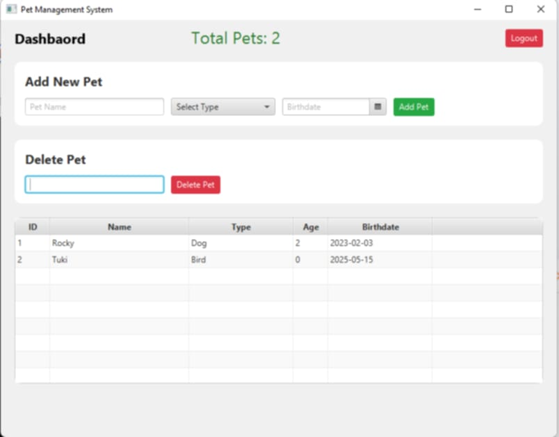

# Pet Management System 2025

## Overview
Pet Management System 2025 is a streamlined JavaFX application designed to help pet owners manage their pets with ease and efficiency. The system focuses on a user-friendly dashboard that provides quick access to essential pet management features, including adding, viewing, and removing pets.

## Features
- 🐾 **Dashboard Overview**: A simple and intuitive interface displaying the core functionalities.
- 🐶 **Add New Pet**: A form to easily add new pets to the system.
- 📋 **Pet Table**: View all registered pets in a structured table format.
- 🗑️ **Remove Pet**: An option to remove pets from the system.

## Technology Stack
- Java 11+
- JavaFX
- FXML
- CSS Styling
- Scene Builder (Recommended)

## Prerequisites
- JDK 11 or higher
- JavaFX SDK
- Maven/Gradle (Optional but recommended)

## Installation

### Clone the Repository
```bash
git clone https://github.com/yourusername/pet-management-2025.git
cd pet-management-2025
```

### Setup
1. Install JavaFX SDK
2. Configure IDE (IntelliJ/Eclipse)
3. Install dependencies

## Screenshots


## Configuration
- Customize `application.properties`
- Adjust any necessary settings for your environment

Developed with ❤️ for pet lovers everywhere!
