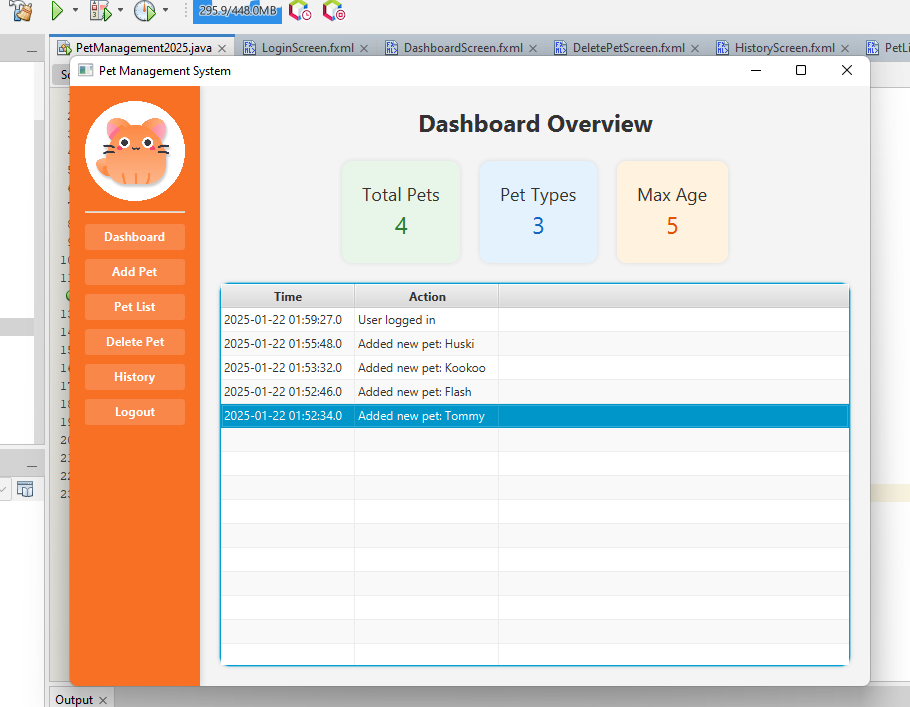
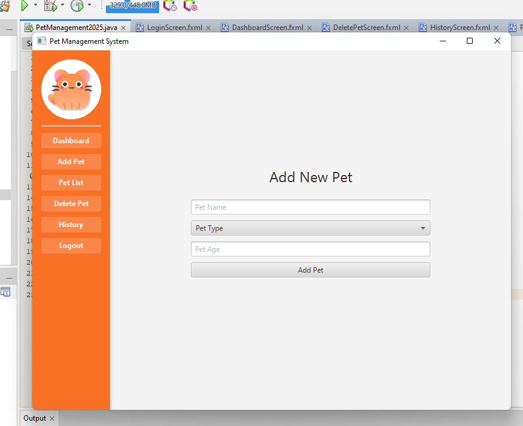

# Pet Management System 2025

## Overview
Pet Management System 2025 is a comprehensive JavaFX application designed to help pet owners and veterinary professionals manage pet-related information efficiently and intuitively.

## Features
- 🐾 Dashboard Overview
- 🐶 Add New Pets
- 📋 Pet List Management
- 🗑️ Pet Deletion
- 📜 Activity History
- 🔐 Secure Logout Functionality

## Technology Stack
- Java 11+
- JavaFX
- FXML
- CSS Styling
- Scene Builder (Recommended)

## Prerequisites
- JDK 11 or higher
- JavaFX SDK
- Maven/Gradle (Optional but recommended)

## Installation

### Clone the Repository
```bash
git clone https://github.com/yourusername/pet-management-2025.git
cd pet-management-2025
```

### Setup
1. Install JavaFX SDK
2. Configure IDE (IntelliJ/Eclipse)
3. Install dependencies

## Screenshots



## Configuration
- Customize `application.properties`
- Adjust database connection settings

Developed with ❤️ for pet lovers everywhere!